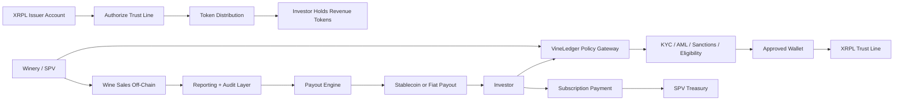

# VineLedger

Compliance-first winery revenue tokenization on XRPL

## Important note before you use this

Your syllabus says GenAI may be used for research, ideation, outlining, proofreading, and code support, but may not be used for generating answers on group assignments.

So treat this file as a research and discussion draft, not as a final submission. Rewrite it with your team, change the assumptions, and make sure the final story matches what your group can actually defend in Q&A.

## 1. Recommended positioning

If Alex suggested "fixed asset tokenization like land or winery, where token holders share the profit of the product", the strongest version for this class is:

- start with winery revenue-share tokenization, not direct land-title tokenization
- use XRPL for issuance, transfer control, escrow, and settlement
- make the product explicitly compliance-aware from day one

Why this is better than direct land tokenization:

- land-title transfer requires integration with property registries and notaries
- profit-sharing land tokens are more likely to trigger securities rules anyway
- wineries give you a more vivid business story: harvest cycle, aging cycle, export cycle, and consumer brand
- wineries also fit the syllabus themes of RWA, tokenization, compliance, and institutional adoption

## 2. One-line startup idea

VineLedger helps small and mid-sized European wineries raise working capital by tokenizing revenue participation in specific vintages or winery SPVs on the XRP Ledger, while enforcing investor onboarding, transfer restrictions, and auditability through a policy gateway.

## 3. Executive summary

Small and mid-sized wineries have long cash-conversion cycles. They spend on grapes, barrels, bottling, storage, and export preparation months before sales are realized. At the same time, the sector faces climate volatility, lower consumption in mature markets, and financing gaps across agriculture and agri-food SMEs.

VineLedger gives wineries a new financing rail. A winery (or a special purpose vehicle tied to a winery and a given vintage) issues a whitelisted XRPL token representing a contractual right to a share of future revenues from that issuance. Investors complete KYC/AML checks, receive approved wallets, buy the token, and later receive pro-rata payouts when wine sales occur. The system is built to be compliant-first rather than crypto-first.

For the MVP, VineLedger does not need a speculative platform token. The main asset is the regulated revenue-share token itself. Optional loyalty or bottle-pass NFTs can be added later for provenance and consumer engagement, but they should not carry profit rights.

## 4. Why this project fits the grading rubric

This direction aligns well with the rubric in `ripple-rubrics.txt`:

- Product demo 40%: you can show a real XRPL token issuance flow on testnet
- Business relevance 40%: the problem is concrete, the users are clear, and the business model is believable
- Compliance 10%: this idea naturally forces a serious legal analysis
- Presentation 10%: the story is concrete and easy to explain visually

It also matches the syllabus:

- Session 8: RWA and tokenization
- Session 11: corporate DeFi, tokenization, stablecoins, XRPL
- Session 14-17: XRPL immersion and startup mentoring
- Session 18-19: policy, MiCA, institutional frameworks, tokenized finance

## 5. Business section

### 5.1 Market introduction

As of April 17, 2026, the wine sector is still a large and globally relevant market:

- The European Commission says the EU is the world's leading wine producer. Between 2020 and 2025, average annual production was 157 million hectolitres, and in 2023 the EU accounted for over 60% of global production and 48% of consumption.
- The same Commission page says wine is the third largest EU agri-food export sector, and EU wine export value accounts for about two thirds of global wine trade.
- The OIV reported on April 15, 2025 that 2024 global wine export value was about EUR 35.9-36.0 billion, with export volumes around 99.8 million hectolitres.
- The European Commission also described the EU wine value chain as contributing about EUR 130 billion to EU GDP and around 3 million direct and indirect full-time jobs.

This means the wine market is:

- big enough to matter
- culturally important in Europe
- internationally traded
- still structurally inefficient for smaller producers

### 5.2 Market specifics

The sector has a few important characteristics that make tokenization interesting:

- long working-capital cycles: harvest, aging, inventory holding, and delayed revenue realization
- fragmented producer base: many smaller wineries do not have the same financing access as major groups
- value depends on provenance, trust, and brand story
- the asset is physical, but the cash flow is delayed and sometimes hard for outside investors to access
- global buyers want exposure, but current access is usually high-ticket, opaque, or intermediated

### 5.3 Key players

You can frame key players as categories instead of memorizing too many company names:

- incumbent wineries and wine groups
- distributors, importers, and merchants
- alternative wine-investment platforms
- tokenization and RWA infrastructure providers

Concrete examples you can mention:

- Vinovest: centralized wine investment platform, not an onchain issuance venue
- OpenVino: wine tokenization and traceability model
- generic RWA tokenization platforms: useful infrastructure, but not winery-specific

### 5.4 Problem you are targeting and proof it exists

The problem is not "wine needs blockchain". The problem is:

Small and mid-sized wineries face expensive and limited financing options for long and uncertain production cycles, while investors have almost no efficient, regulated way to access winery-linked cash flows in smaller ticket sizes.

Proof points:

1. Sector pressure is real.

- OIV reported that 2024 global wine production fell to 226 million hectolitres, the lowest in over 60 years, and consumption fell to an estimated 214 million hectolitres, the lowest since 1961.
- The European Commission highlighted declining demand, changing consumer preferences, and climate stress as central challenges for the EU wine sector.

2. Financing pressure is real.

- In October 2023, the European Commission said unmet bank-financing demand reached EUR 62 billion for EU farmers in 2022.
- The same Commission update said the financing gap for SMEs processing agri-food products was EUR 5.5 billion.

3. Existing access models are weak.

- traditional winery finance depends on bank debt, distributors, advance purchase agreements, or wealthy insiders
- wine investment platforms usually give exposure to bottles or managed portfolios, not direct winery cash flows
- many blockchain wine projects emphasize collectibility and traceability more than regulatory-grade financing

### 5.5 Unique value proposition

VineLedger combines three things that are usually separated:

- revenue-linked winery financing
- fractional investor access
- compliance-aware transfer control on a public blockchain

Simple version:

"We turn a winery's future sales into a programmable, auditable, and compliant financing product on XRPL."

### 5.6 Target users and benefits

Primary user 1: wineries

- faster access to working capital
- broader investor base
- lower dependence on traditional lenders
- marketing upside from turning supporters into investors

Primary user 2: investors

- smaller minimum ticket sizes
- access to a real-world asset theme that is otherwise hard to enter
- transparent payout logic
- optional secondary liquidity among approved participants

Secondary user: wine clubs, premium consumers, distributors

- provenance and storytelling
- optional loyalty benefits
- optional product allocation rights

### 5.7 Token design

Recommended design for the MVP:

- no native platform token
- one regulated fungible token per issuance
- optional non-financial NFT for bottle provenance or membership perks

Why no platform token:

- it keeps the story cleaner
- it reduces compliance complexity
- it makes the business feel more serious and less speculative

Illustrative issuance example:

- SPV: "Rioja 2027 Reserve SPV"
- raise target: EUR 1,000,000
- token supply: 1,000,000 tokens
- issue price: EUR 1 per token
- investor right: pro-rata share of a defined revenue or profit pool from that SPV's covered product line
- payout frequency: quarterly or semi-annual
- lockup: 12 months before transfer is allowed between approved wallets

Important compliance point:

Because the token gives profit or revenue participation, it is very likely to be treated as a financial instrument or security. That is not a bug in the project. It is actually one of the strongest parts of your compliance analysis.

### 5.8 Business model

Recommended revenue model:

- 4% issuance structuring fee
- 1% annual servicing and reporting fee
- 0.5% fee on approved secondary transfers
- optional winery SaaS fee for traceability and reporting tools

Why it works:

- one-time revenue from each deal
- recurring revenue from compliance and servicing
- platform upside if a secondary market becomes active

### 5.9 Competitive landscape

#### Traditional alternatives

- bank loans
- distributor pre-financing
- private placements
- crowdfunding

Weakness:

- slow
- geographically constrained
- high friction
- little programmability

#### Wine investment platforms

- examples like Vinovest provide wine-investment access but mainly through centralized custody and portfolio management

Weakness:

- investor gets exposure to wine inventory, not direct winery fundraising infrastructure

#### Web3 wine projects

- examples like OpenVino focus on wine-backed assets, traceability, and community interaction

Weakness:

- less centered on an institutional, compliance-heavy financing stack

#### General tokenization infrastructure

- can tokenize many asset classes

Weakness:

- does not solve winery sourcing, underwriting, product storytelling, or sector-specific distribution

#### Why VineLedger is different

- sector-specific
- compliance-first
- XRPL-native
- focused on real issuer pain: working capital
- easier to defend legally than "global retail land tokenization"

### 5.10 Go-to-market plan

Phase 1: pilot

- start with 1-2 wineries in Spain or France
- focus on a single jurisdiction first
- target professional investors, HNWIs, wine clubs, and close network investors
- run one issuance tied to one vintage or one product line

Phase 2: repeatability

- standardize SPV and legal templates
- add a simple investor dashboard
- onboard 5-10 wineries
- introduce secondary transfers between approved wallets

Phase 3: ecosystem expansion

- add provenance NFTs and bottle redemption features
- partner with export distributors and wine tourism channels
- expand to olive oil, specialty agriculture, or premium food assets

Best early acquisition channels:

- winery associations and accelerators
- legal/accounting partners serving family wineries
- premium wine clubs and collectors
- XRPL Commons and IE startup network

## 6. Technical section

### 6.1 Why XRPL

XRPL is a strong fit for this use case because current XRPL documentation highlights:

- settlement in 3-5 seconds for a fraction of a cent
- native compliance capabilities
- native DEX and onchain order books
- issuer-defined authorization, freeze controls, and multisignature support

For the MVP, the best choice is to use XRPL trust line tokens, not Multi-Purpose Tokens.

Why:

- XRPL docs describe trust line tokens as the production-ready fungible-token standard
- XRPL docs describe MPTs as still in active development and not yet at full feature parity

That gives you a very defensible answer if the professor asks, "Why this token standard?"

### 6.2 High-level architecture

Components:

- winery / SPV onboarding portal
- policy gateway for KYC, AML, sanctions, accreditation, and jurisdiction checks
- XRPL issuer account
- XRPL distribution account
- investor wallets
- offchain reporting and payout engine
- optional dashboard for issuance status and sales reporting

### 6.3 Transaction flow

### 6.4 Suggested onchain controls

- `RequireAuth` on the issuer account so only approved wallets can hold the token
- authorized trust lines for allow-listing
- multisig on treasury or operational accounts
- freeze capability for suspicious or non-compliant accounts
- token escrow for lockups or staged releases
- metadata links to offering memo, audit files, and SPV reports

### 6.5 MVP demo you can realistically build

For a class project, do not overbuild. A strong MVP is enough.

Recommended demo flow:

1. Create testnet issuer, treasury, and investor accounts.
2. Show investor KYC completed off-chain in a simple dashboard or mocked admin page.
3. Show the investor creating a trust line to the issuer token.
4. Show the issuer authorizing that trust line.
5. Mint and distribute the winery token to the investor wallet.
6. Simulate a wine-sale event off-chain.
7. Trigger a payout in a test token or test stablecoin.
8. Optionally demonstrate freezing a non-compliant wallet.

This is enough to demonstrate:

- real XRPL interaction
- policy gateway logic
- token lifecycle
- compliance-aware controls

### 6.6 Demo narrative

The best demo line is:

"This is not just a token mint. It is a full compliant financing flow: onboarding, allow-listing, issuance, monitoring, and payout."

### 6.7 Why the technical design is credible

XRPL official docs state that:

- trust line tokens are production-ready
- authorized trust lines allow allow-listing
- escrow can lock fungible tokens when token escrow is enabled
- multisigning can distribute control

This lets you show real platform mechanics without needing a complex smart-contract stack.

## 7. Compliance section

### 7.1 Legal landscape

As of April 17, 2026, the key EU compliance point is this:

- MiCA is in force, but MiCA does not apply to crypto-assets that qualify as financial instruments
- the EU Commission also states MiCA covers crypto-assets not already covered by other financial-services legislation

Inference from those rules:

If your token gives holders a right to share in revenues or profits, regulators are likely to view it as a financial instrument or transferable security rather than a simple utility token.

That means your project should not say:

- "This is a utility token"
- "This is just community ownership"
- "This avoids securities law because it is on blockchain"

Instead, your project should say:

- "We intentionally structure the pilot as a regulated or exempt security-like issuance"

That answer sounds much more mature.

### 7.2 Recommended launch structure

Recommended Phase 1 structure:

- issue through an SPV or equivalent legal issuer
- use a private-placement style pilot
- limit initial participation to approved, eligible investors
- partner with external legal counsel and, where needed, licensed intermediaries

Why this is smart:

- reduces retail-consumer risk
- makes KYC/AML easier
- keeps the compliance story realistic
- avoids pretending that land or winery profit rights can be globally sold with no restrictions

### 7.3 Why not start with direct land-title tokenization

This is a very strong line for Q&A:

"We are not tokenizing land title in the MVP. We are tokenizing a contractual economic right issued by a compliant SPV. Direct land-title tokenization would require deeper integration with national property law, registries, and notarial infrastructure."

This shows legal maturity and protects the project from easy attacks.

### 7.4 Secondary market compliance

Your best approach:

- transfers only between approved wallets
- no anonymous retail trading in MVP
- holding-period rules enforced off-chain and on-chain
- future secondary trading only through an authorized venue or regulated partner

You can also mention that the EU's DLT Pilot Regulation exists as a framework for market infrastructures dealing with DLT financial instruments.

### 7.5 AML, KYC, and policy gateway logic

The policy gateway should check:

- identity verification
- sanctions screening
- jurisdiction restrictions
- source-of-funds review
- investor category
- holding limits
- transfer lockups

Why this matters:

- the European Commission states MiCA-related firms are part of the AML framework as obliged entities
- even when the token is treated as a financial instrument instead of a MiCA crypto-asset, AML/KYC expectations do not disappear

### 7.6 Data privacy and reporting

Recommended approach:

- keep personal data off-chain
- store only hashes, references, or public issuance metadata on-chain
- publish periodic reports signed by the issuer or auditor

That gives you a GDPR-friendly answer:

"Sensitive investor data remains off-chain. The chain is used for transfer state, attestation references, and auditable event history."

### 7.7 Legal limitations and your response

Limitation 1:

Revenue-share tokens are likely securities.

Response:

- embrace that classification
- structure issuance under securities rules or exemptions

Limitation 2:

Cross-border distribution is complex.

Response:

- start in one jurisdiction
- expand only after legal templates are standardized

Limitation 3:

Public-chain assets can conflict with transfer restrictions.

Response:

- use XRPL allow-listing, freeze controls, and policy gateway checks

Limitation 4:

Off-chain sales data can be manipulated.

Response:

- require auditor review, periodic attestation, multisig approvals, and reconciliation

## 8. Conclusion section

### 8.1 Roadmap

#### 0-3 months

- validate legal structure with counsel
- onboard first pilot winery
- build testnet issuance flow
- create mock investor dashboard

#### 3-6 months

- launch first pilot issuance
- complete first payout cycle
- publish first transparency report

#### 6-12 months

- onboard 3-5 wineries
- add secondary transfer workflow
- add provenance NFT module

#### 12-24 months

- expand to multiple EU regions
- partner with regulated trading venue or crowdfunding/intermediation partner
- extend product to adjacent agri-food assets

### 8.2 Team composition

You do not need to pretend your current team already has all these roles. Just show what the startup would need:

- CEO / business lead
- blockchain engineer with XRPL experience
- full-stack product engineer
- compliance and legal lead
- finance / structuring lead
- winery partnerships and operations lead
- data / reporting / audit support

### 8.3 Key risks and mitigation

Risk 1: legal misclassification or distribution breach

Mitigation:

- start with a restricted pilot
- use outside counsel
- avoid open retail sale in MVP

Risk 2: low secondary liquidity

Mitigation:

- focus first on yield and transparency, not speculation
- create periodic buyback windows or matched liquidity events

Risk 3: winery underperformance or climate shock

Mitigation:

- conservative underwriting
- insurance where possible
- diversify by region and vintage over time

Risk 4: bad off-chain data or fraud

Mitigation:

- independent reporting
- multisig approvals
- auditor attestations
- clear waterfall and payout rules

## 9. Suggested 10-minute presentation structure

Because the rubric values both business and demo, I would recommend:

- 6-7 minutes presentation
- 3-4 minutes demo

Slide structure:

1. Title + one-line problem
2. Market size and why now
3. Problem proof
4. Solution and value proposition
5. Business model and target users
6. XRPL architecture and transaction flow
7. Demo
8. Compliance strategy
9. Roadmap + team
10. Risks + closing

## 10. Strong lines for the presentation

Use short lines like these:

- "We are not using blockchain because it is trendy. We are using it because this financing product needs programmable transfer rules, fractional access, and transparent payouts."
- "The MVP does not tokenize land title. It tokenizes a compliant economic right issued by an SPV."
- "XRPL is attractive here because we can get issuance, allow-listing, escrow, and fast settlement without building a heavy smart-contract system."
- "Our product is compliance-first. The policy gateway is part of the product, not an afterthought."

## 11. Likely professor questions

### Why XRPL and not Ethereum?

Because XRPL gives us native token issuance, allow-listing, freeze controls, multisig, DEX functionality, and fast low-cost settlement with less engineering overhead for an MVP.

### Is this token under MiCA?

Probably not in the simple sense. Because it gives revenue or profit participation, it is more likely to be treated as a financial instrument. That means we design for securities-style compliance rather than pretending it is a simple utility token.

### Why start with wineries instead of land?

Because winery revenue rights are easier to structure and demonstrate in an MVP. Direct land-title tokenization requires much deeper legal and registry integration.

### What if the winery lies about sales?

Use audited reporting, escrow accounts where possible, signed disclosures, multisig payout approvals, and staged distributions.

### Why would investors buy this?

Because it gives access to a hard-to-reach real-world asset theme with smaller ticket sizes, transparent reporting, and optional yield plus brand upside.

## 12. Sources you can cite

Use these in your slides or appendix. All were checked while preparing this draft.

- OIV, "State of the World Vine and Wine Sector in 2024" (press release, April 15, 2025): https://www.oiv.int/sites/default/files/2025-04/EN_OIV_Press_release_State_of_the_World_Vine_and_Wine_Sector_in_2024.pdf
- European Commission, "Wine": https://agriculture.ec.europa.eu/farming/crop-productions-and-plant-based-products/wine_en
- European Commission, "Access to finance remains insufficient for farmers and agri-food SMEs" (October 12, 2023): https://agriculture.ec.europa.eu/news/access-finance-remains-insufficient-farmers-and-agri-food-smes-2023-10-12_en
- European Commission, "High-Level Group on Wine outlines policy recommendations for the future of the EU wine sector" (December 17, 2024): https://agriculture.ec.europa.eu/media/news/high-level-group-wine-outlines-policy-recommendations-future-eu-wine-sector-2024-12-17_en
- XRP Ledger Docs, "Real-World Asset (RWA) Tokenization": https://xrpl.org/docs/use-cases/tokenization/real-world-assets
- XRP Ledger Docs, "Fungible Tokens": https://xrpl.org/trust-lines-and-issuing.html
- XRP Ledger Docs, "Authorized Trust Lines": https://xrpl.org/docs/concepts/tokens/fungible-tokens/authorized-trust-lines
- XRP Ledger Docs, "Escrow": https://xrpl.org/docs/concepts/payment-types/escrow
- XRP Ledger Docs, "Multi-Signing": https://xrpl.org/docs/concepts/accounts/multi-signing/
- European Commission, "Crypto-assets": https://finance.ec.europa.eu/digital-finance/crypto-assets_en
- EUR-Lex, MiCA Regulation (EU) 2023/1114, especially Article 2 scope/exclusions: https://eur-lex.europa.eu/legal-content/EN/TXT/?uri=CELEX%3A32023R1114
- Ripple + BCG tokenization estimate, April 7, 2025: https://ripple.com/ripple-press/global-financial-infrastructure-entering-a-new-era/
- World Economic Forum, "Asset Tokenization in Financial Markets" (May 21, 2025): https://www.weforum.org/publications/asset-tokenization-in-financial-markets-the-next-generation-of-value-exchange/

## 13. Final recommendation

If you want the safest high-grade version of this project, pitch it as:

"VineLedger is a compliance-first XRPL platform for tokenized winery revenue financing, starting with private, whitelisted issuance for a specific vintage or winery SPV."

That story is:

- more realistic than generic "tokenize land"
- more technical than a simple marketplace
- more compliant than a pure DeFi idea
- easier to defend in Q&A
